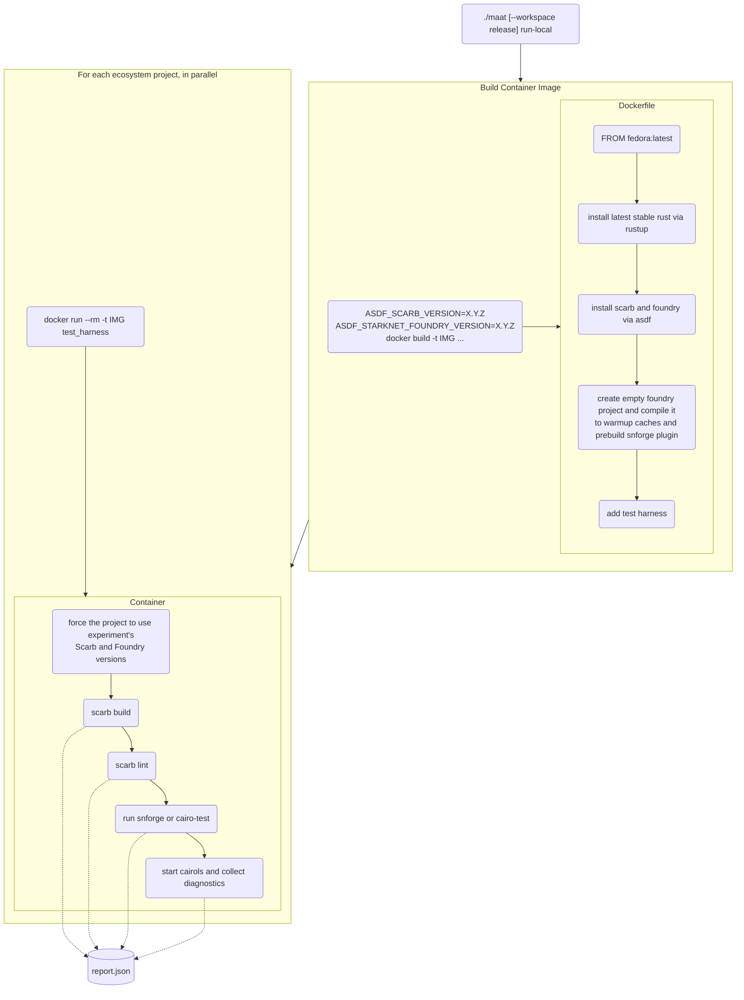

<div align="center">
  <picture>
    
  </picture>

# Ma'at

Ma'at is a tool to run experimental software builds across [Cairo] language ecosystem.
Something like [Crater] of [Rust], but for Cairo.
</div>

---

## Getting started

Ma'at is a Python application ([uv]-powered).
You can clone this repository, set up a local workspace and run it locally.

You need the following things to have up and running on your machine:

- [uv]
- Docker (or compatible stack like Podman or OrbStack)
    - you need `docker` CLI to be accessible via `PATH`
- _Only for development_: Node.js (there is a line for it in `.tool-versions`)

To get started, run:

```shell
./maat
```

The CLI will guide you through configuring your experiment.

## Flow

Ma'at experiment run roughly performs the following steps:



You can then compare two reports with the following invocation to detect regressions:

```shell
./maat build-web old_report.json report.json
```

## Debugging reports

With Jupter Notebooks or Python REPL it is fairly easy to inspect reports and look for some traces
of errors.
Check out [`sample_notebook.ipynb`](./sample_notebook.ipynb) file for examples.
The `maat.model.Report` class provides a fully typed representation of report files.
The `maat.repl` module provides some handy utilities.

## Notifications

`./maat run-local` can emit a notification upon finish on macOS (via `osascript`) and Linux (via
`notify-send`).
On macOS, by default scripts have no privileges granted to send notifications,
and this results in no notifications appearing from Ma'at.
To fix this, open `Script Editor.app` and run the following script:

```applescript
display notification "world" with title "hello"
```

This should result in a notification permission request for Script Editor to appear which you need
to accept—after this, Ma'at will successfully notify on experiment completion.

[cairo]: https://www.cairo-lang.org/

[crater]: https://github.com/rust-lang/crater

[rust]: https://rust-lang.org/

[uv]: https://docs.astral.sh/uv/
