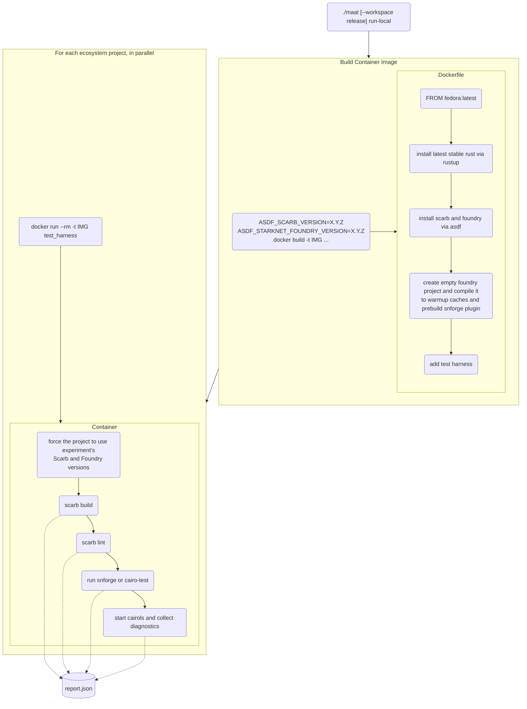

<div align="center">
  <picture>
    
  </picture>

# Ma'at

Ma'at is a tool to run experimental software builds across [Cairo] language ecosystem.
Something like [Crater] of [Rust], but for Cairo.
</div>

---

## Getting started

Ma'at is a Python application ([uv]-powered).
You can clone this repository, set up a local workspace and run it locally.

You need the following things to have up and running on your machine:

- [uv]
- Docker (or compatible stack like Podman or OrbStack)

To get started, run:

```shell
./maat
```

The CLI will guide you through configuring your experiment.

## Flow

Ma'at experiment run roughly performs the following steps:



You can then compare two reports with the following invocation to detect regressions:

```shell
./maat diff old_report.json report.json
```

[cairo]: https://www.cairo-lang.org/
[crater]: https://github.com/rust-lang/crater
[rust]: https://rust-lang.org/
[uv]: https://docs.astral.sh/uv/
