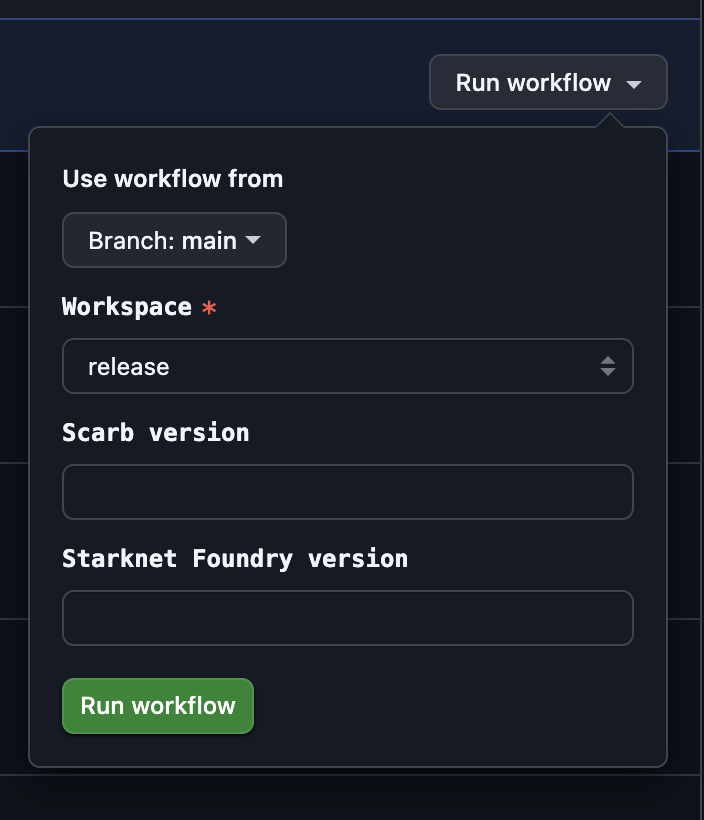

# Experiments

## Environment

Ma'at experiments run in a Docker container environment defined in
[`src/maat/agent/Dockerfile`](/src/maat/agent/Dockerfile).
This environment is carefully configured to provide a consistent and reproducible platform for
testing Cairo ecosystem projects.

The experiment environment includes:

- **Base OS**: Fedora
- **Programming Languages**: Node.js, Rust, Python (with UV package manager)
- **Version Management**: ASDF
- **Build Tools**: GCC/G++, Git, Make
- **Cairo Toolchain**:
  - Scarb (with cairo-lint and CairoLS bundled)
  - Starknet Foundry

This containerised approach ensures that all experiments run in controlled environments,
eliminating "works on my machine" issues and providing reliable regression testing across
the Cairo ecosystem.

## Workflow

When Ma'at runs an experiment, it follows these key steps:

1. **Plan Preparation**: Ma'at creates a plan that defines which tests to run on which projects.
2. **Environment Setup**: The Docker container is initialised with the specified versions of Scarb
   and Starknet Foundry.
3. **Project Checkout**: The target Cairo ecosystem projects are downloaded from
   [scarbs.xyz](https://scarbs.xyz) or checked out from their repos.
4. **Test Execution**: For each project, Ma'at executes a series of steps:
  - building the project with Scarb,
  - running tests with appropriate test runners,
  - checking code with linters and other tools.
5. **Report Generation**: Results are collected and formatted into JSON reports.
   Significant reports are committed to this repository.
6. **Analysis**: Reports are analysed to detect regressions or improvements between different Cairo
   toolchain versions.

Each test execution is isolated to prevent cross-contamination between tests, and detailed logs are
captured for debugging purposes.

## Scheduling

The easiest way to perform an experiment is to schedule it on a GitHub Actions-powered queue.
This is only available to authorised Cairo team members.

1. Go to the [Experiment](https://github.com/software-mansion/maat/actions/workflows/experiment.yml)
   workflow page.
2. Click `Run workflow`.
3. Fill experiment parameters:

   <!--suppress CheckImageSize -->
   

   You can skip Scarb and/or Foundry versions. Ma'at will pick the latest ones respectively to what
   is specified in the particular workspace config.
   You can also set "Custom report name" to override the file name used for generated report files.
   When not set, Ma'at generates the name automatically based on the workspace and tool versions.
